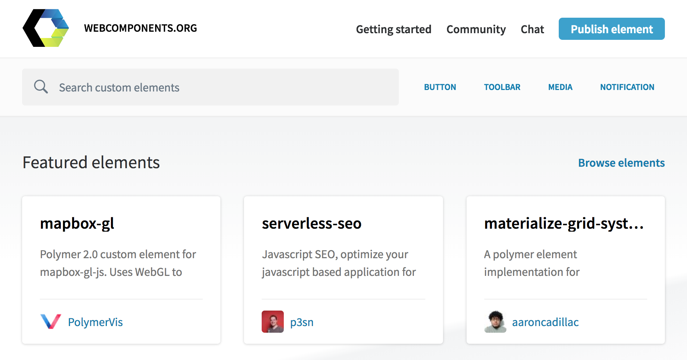
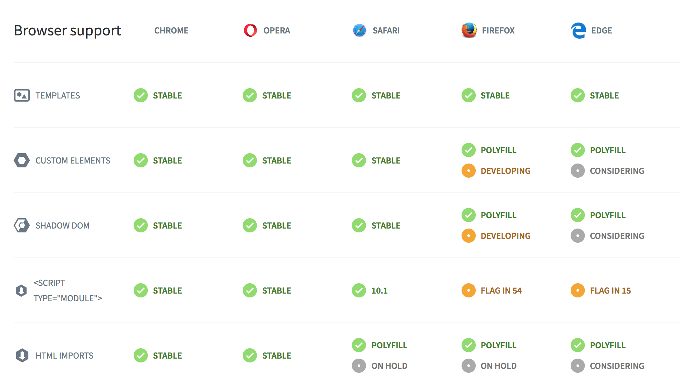
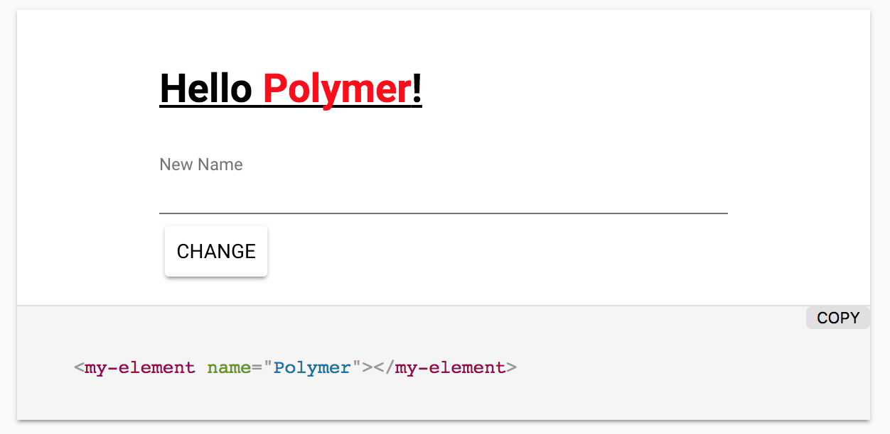

title: Web Components
author:
  url: https://github.com/hedlund/polymer-react-elm
output: web-components.html
controls: true
theme: ./theme

--

#  
## **Web Components, Polymer & code sharing**

--

### Web Components

A concept built on a set of web standards to create custom, reusable, encapsulated HTML tags.

Primarily based on four specifications:

* [Custom Elements](https://w3c.github.io/webcomponents/spec/custom/)
* [Shadow DOM](https://w3c.github.io/webcomponents/spec/shadow/)
* [HTML imports](https://w3c.github.io/webcomponents/spec/imports/)
* [HTML template](https://html.spec.whatwg.org/multipage/scripting.html#the-template-element/)


--

### Custom Elements

TBD

-- 

### Shadow DOM

TBD

-- 

### Shadow DOM != Virtual DOM

Virtual DOM:

Shadow DOM:
* Subtree
* Encapsulation

--

### HTML imports

TBD

-- 

### HTML template

TBD

-- 

### [webcomponents.org](https://www.webcomponents.org)



--

### Using Web Components

Install Polyfills & components:

```
bower install webcomponents/webcomponentsjs
bower install emoji-rain
```

Link the files in your HTML page:

```
<script src="bower_components/webcomponentsjs/webcomponents-lite.js"></script>
<link rel="import" href="bower_components/emoji-rain/emoji-rain.html">
```

Use the imported component:

```
<emoji-rain active></emoji-rain>
```


--

<emoji-rain active style="position: absolute; top: 0; left: 0"></emoji-rain>
# Great success!
<div style="font-family: monospace; text-align: center">
  &lt;emoji-rain active&gt;&lt;/emoji-rain&gt;
</div>

--

### Browser support



--

### Libraries to make life easier

* [Polymer](https://www.polymer-project.org/)
* [Bosonic](https://bosonic.github.io/)
* [SkateJS](https://github.com/skatejs/skatejs)
* [Slim.js](http://slimjs.com/)
* [Stencil](https://stenciljs.com/)
* [X-Tag](https://x-tag.github.io/)

--

<div style="position: relative">
  <div style="position: absolute; bottom: 0">
    <h1>Polymer</h1>
    <h2 style="position: relative; top: -30px; left: 110px">#UseThePlatform</h2>
  </div>
  
  
</div>

--

### Polymer Project

Google project focusing on libraries, tools and patterns for **Progressive Web Apps**, taking full advantage of cutting-edge platform features like **Web Components**, **Service Workers** and **HTTP/2**.

-- 

### Polymer Library

Polymer sprinkles a bit of sugar over the standard Web Components APIs.

```
<dom-module id="x-custom">
      <template>
        <div>{{greeting}}</div>
      </template>

      <script>
        class XCustom extends Polymer.Element {

          static get is() { return 'x-custom'; }

          static get properties() {
            return {
              greeting: {
                type: String,
                value: "Hello!"
              }
            }
          }
        }

        customElements.define(XCustom.is, XCustom);
      </script>
    </dom-module>
```

--

### Polymer App Toolbox

A collection of components, tools and templates for building Progressive Web Apps:

* [Iron Elements](https://www.webcomponents.org/collection/PolymerElements/iron-elements): Basic application building blocks
* [Paper Elements](https://www.webcomponents.org/collection/PolymerElements/paper-elements): A set of UI components implementing Google's Material Design
* [Gold Elements](https://www.webcomponents.org/collection/PolymerElements/gold-elements): E-commerce form elements
* [Platinum Elements](https://www.webcomponents.org/collection/PolymerElements/platinum-elements): App-like features - push notifications, offline caching, bluetooth

--

### Polymer element structure

```
<link rel="import" href="../polymer/polymer-element.html">

<dom-module id="my-element">
  <template>
    <style> /* The styles */</style>

    <div>
      <!-- The view -->
    </div>
  </template>

  <script>
    class MyElement extends Polymer.Element {
      /* The logic */
    }

    window.customElements.define(MyElement.is, MyElement);
  </script>
</dom-module>
```

--



--

### Importing dependencies

```
<link rel="import" href="../polymer/polymer-element.html">
<link rel="import" href="../paper-input/paper-input.html">
<link rel="import" href="../paper-button/paper-button.html">
<link rel="import" href="../iron-icons/iron-icons.html">

<dom-module id="my-element">
  <template>
    <style> /* The styles */</style>

    <div>
      <!-- The view -->
    </div>
  </template>

  ...
```


--

### Template

```
  <template>
    <style>
      h1 {
        text-decoration: underline;
      }

      .name {
        color: red;
      }
    </style>

    <div class="container">

      <h1>Hello <span class="name">[[name]]</span>!</h1>

      <div>
        <paper-input always-float-label label="New Name" id="newName"></paper-input>
        <paper-button raised class="green" on-click="handleClick">Change</paper-button>
      </div>

    </div>
  </template>
```


--

### Script

```
  <script>
    class MyElement extends Polymer.Element {
      static get is() { return 'my-element'; }
      static get properties() {
        return {
          name: {
            type: String,
            value: 'Polymer'
          }
        };
      }

      handleClick() {
        if (this.$.newName.value !== '') {
          this.dispatchEvent(new CustomEvent('changeTheName', {
            detail: {
              name: this.$.newName.value
            }
          }));
          this.$.newName.value = '';
        }
      }
    }

    window.customElements.define(MyElement.is, MyElement);
  </script>
```


--

### Polymer 3

```
import { Element }
    from '../node_modules/@polymer/polymer/polymer-element.js';

export class MyApp extends Element {

  static get template() {
    return `<div>This is my [[name]] app.</div>`
  }

  constructor() {
    super();
    this.name = '3.0 preview';
  }

  static get properties() {
    name: {
      Type: String
    }
  }
}

customElements.define('my-app', MyApp);
```


--

# Why?

--

# Why?


--

# Why?


--

# Why?


--

# Why?


--

### Code Sharing <span style="font-weight: normal; font-size: 0.5em; color: #aaa"> a.k.a. I'm lazy & don't want to do it twice!</span>

Hosted NPM repository for module sharing:

* Nexus
* Sinopia
* Private npmjs.com

Share modules of:

* Styling (CSS/Less/Sass)
* React/Angular/Elm components

--

<emoji-rain active style="position: absolute; top: 0; left: 0"></emoji-rain>
# Share Web Components Instead!

--

### React

```
class App extends Component {
  render() {
    return (
      <div className="App">
        <my-element name={this.props.name} />
      </div>
    );
  }
}
```

--

### React: Adding event handling

```
class App extends Component {

  componentDidMount() {
    this.elem.addEventListener('changeTheName', this.onChangeTheName);
  }

  componentWillUnmount() {
    this.elem.removeEventListener('changeTheName', this.onChangeTheName);
  }

  onChangeTheName({ detail: { name } }) {
    // use the name
  }

  render() {
    return (
      <div className="App">
        <my-element name={this.props.name} ref={e => this.elem = e} />
      </div>
    );
  }
}
```

--

### Elm

```
myElement : List (Attribute msg) -> List (Html msg) -> Html msg
myElement attributes children =
    node "my-element" attributes children


view : Model -> Html Msg
view model =
    div []
        [ myElement [ attribute "name" model.name] []
        ]
```

--

### Elm: Adding event handling

```
nameExtractor : Json.Decoder String
nameExtractor =
    Json.at [ "detail", "name" ] Json.string

onChangeTheName : (String -> msg) -> Attribute msg
onChangeTheName msg =
    on "changeTheName" (Json.map msg nameExtractor)

myElement : List (Attribute msg) -> List (Html msg) -> Html msg
myElement attributes children =
    node "my-element" attributes children


view : Model -> Html Msg
view model =
    div []
        [ myElement [ attribute "name" model.name, , onChangeTheName ChangeTheName] []
        ]
```