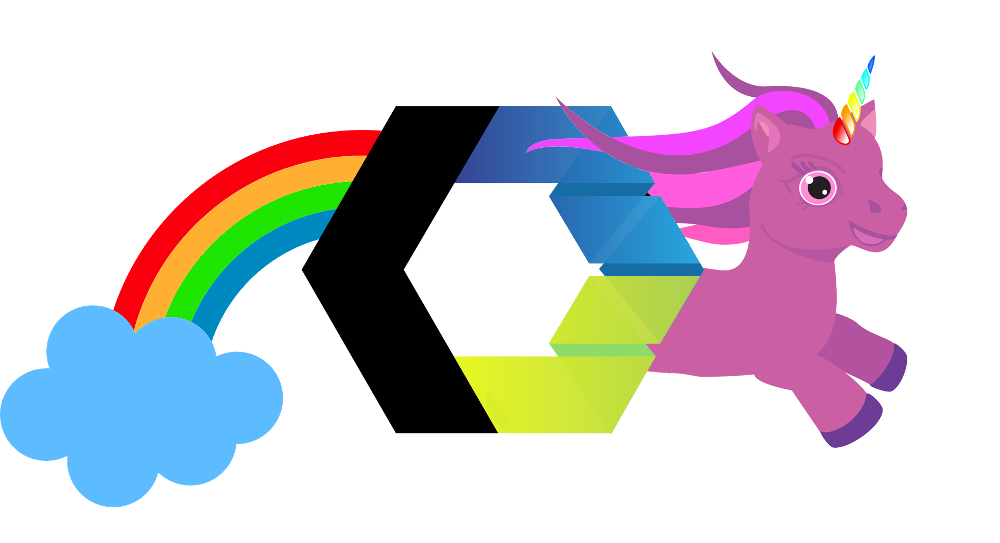
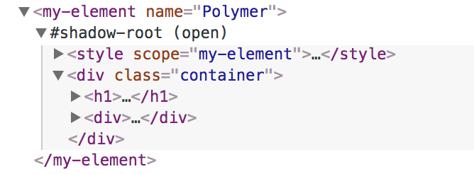

title: Web Components
author:
  url: https://github.com/hedlund/polymer-react-elm
output: web-components.html
controls: true
theme: ./theme

--


 
<h2 style="font-weight: bold; font-size: 2.2em; margin-top: -50px">Web Components, Rainbows & Unicorns</h2>

<p style="font-style: italic; font-size: 18px; position: absolute; right: 20px; bottom: 20px;">
  DISCLAIMER: May not actually contain any rainbows nor unicorns.
</p>

--

### Web Components

A concept built on a set of web standards to create custom, reusable, encapsulated HTML tags.

Primarily based on four specifications:

1. [Custom Elements](https://w3c.github.io/webcomponents/spec/custom/)
2. [Shadow DOM](https://w3c.github.io/webcomponents/spec/shadow/)
3. [HTML template](https://html.spec.whatwg.org/multipage/scripting.html#the-template-element/)
4. [HTML imports](https://w3c.github.io/webcomponents/spec/imports/)


--

### 1. Custom Elements

Specify and build custom DOM elements in a standardized way.

<pre>
<span class="high1">class FlagIcon extends HTMLElement {</span>

  static get observedAttributes() { return ["country"]; }

  attributeChangedCallback(name, oldValue, newValue) {
    this._countryCode = newValue;
    this._updateRendering();
  }

  connectedCallback() { this._updateRendering(); }

  get country() { return this._countryCode; }
  set country(v) { this.setAttribute("country", v); }

  _updateRendering() { /* ... */ }
}

<span class="high1">customElements.define("flag-icon", FlagIcon);</span>
</pre>

-- 

### 2. Shadow DOM

* Isolated, self-contained & scoped DOM subtree
* Scoped styles -> bundle CSS with markup
* Primary purpose is **encapsulation**



<p style="font-size: 1.6em; font-weight: bold; color: red; text-align: center">
  <marquee>Shadow DOM !== Virtual DOM</marquee>
</p>

-- 

### 3. HTML template

Native way of defining templates...

Defining:

<pre>
&lt;template id=<span class="high1">&quot;mytemplate&quot;</span>&gt;
    &lt;img <span class="high3">src=&quot;&quot;</span> alt=&quot;an image&quot;&gt;
    &lt;div class=&quot;comment&quot;&gt;&lt;/div&gt;
&lt;/template&gt;
</pre>

Using:

<pre>
var t = document.querySelector(<span class="high1">'#mytemplate'</span>);
<span class="high3">t.content.querySelector('img').src = 'logo.png';</span>

var clone = document.importNode(t.content, true);
document.body.appendChild(clone);
</pre>

--

### 4. HTML imports

* Basically a simple way of loading/linking HTML (including JS & CSS).
* Automatically de-duped
* Not widely supported!

<pre>
&lt;head&gt;
  &lt;link <span class="high1">rel=&quot;import&quot;</span> href=&quot;/path/to/file.html&quot;&gt;
&lt;/head&gt;
</pre>

--

### Browser support


--

### [webcomponents.org](https://www.webcomponents.org)


--

### Using Web Components

Install Polyfills & components:

```
bower install webcomponents/webcomponentsjs
bower install emoji-rain
```

Link the files in your HTML page:

```
<script src="bower_components/webcomponentsjs/webcomponents-lite.js"></script>
<link rel="import" href="bower_components/emoji-rain/emoji-rain.html">
```

Use the imported component:

```
<emoji-rain active></emoji-rain>
```


--

<emoji-rain active style="position: absolute; top: 0; left: 0"></emoji-rain>
# Great success!
<div style="font-family: monospace; text-align: center">
  &lt;emoji-rain active&gt;&lt;/emoji-rain&gt;
</div>

--

### Libraries to make life easier

* [Polymer](https://www.polymer-project.org/)
* [Bosonic](https://bosonic.github.io/)
* [SkateJS](https://github.com/skatejs/skatejs)
* [Slim.js](http://slimjs.com/)
* [Stencil](https://stenciljs.com/)
* [X-Tag](https://x-tag.github.io/)

--

<div style="position: relative">
  <div style="position: absolute; bottom: 0">
    <h1>Polymer</h1>
    <h2 style="position: relative; top: -30px; left: 110px">#UseThePlatform</h2>
  </div>
  
  
</div>

--

### 1. Polymer Project

Google project focusing on libraries, tools and patterns for **Progressive Web Apps**, taking full advantage of cutting-edge platform features like **Web Components**, **Service Workers** and **HTTP/2**.

-- 

### 2. Polymer Library

Polymer sprinkles a bit of sugar over the standard Web Components APIs.

```
<dom-module id="x-custom">
      <template>
        <div>{{greeting}}</div>
      </template>

      <script>
        class XCustom extends Polymer.Element {

          static get is() { return 'x-custom'; }

          static get properties() {
            return {
              greeting: {
                type: String,
                value: "Hello!"
              }
            }
          }
        }

        customElements.define(XCustom.is, XCustom);
      </script>
    </dom-module>
```

--

### 3. Polymer App Toolbox

A collection of components, tools and templates for building Progressive Web Apps:

* [Iron Elements](https://www.webcomponents.org/collection/PolymerElements/iron-elements): Basic application building blocks
* [Paper Elements](https://www.webcomponents.org/collection/PolymerElements/paper-elements): A set of UI components implementing Google's Material Design
* [Gold Elements](https://www.webcomponents.org/collection/PolymerElements/gold-elements): E-commerce form elements
* [Platinum Elements](https://www.webcomponents.org/collection/PolymerElements/platinum-elements): App-like features - push notifications, offline caching, bluetooth

--

### Polymer element structure

<pre>
<span class="high1">&lt;link rel=&quot;import&quot; href=&quot;../polymer/polymer-element.html&quot;&gt;</span>

&lt;dom-module id=&quot;my-element&quot;&gt;
<span class="high2">  &lt;template&gt;
    &lt;style&gt; /* The styles */&lt;/style&gt;

    &lt;div&gt;
      &lt;!-- The view --&gt;
    &lt;/div&gt;
  &lt;/template&gt;</span>


<span class="high3">  &lt;script&gt;
    class MyElement extends <span class="high1">Polymer.Element</span> {
      /* The logic */
    }

    window.customElements.define(MyElement.is, MyElement);
  &lt;/script&gt;</span>
&lt;/dom-module&gt;
</pre>

--

### Writing a component


--

### Importing dependencies

<pre>
&lt;link rel=&quot;import&quot; href=&quot;../polymer/polymer-element.html&quot;&gt;
<span class="high1">&lt;link rel=&quot;import&quot; href=&quot;../paper-input/paper-input.html&quot;&gt;
&lt;link rel=&quot;import&quot; href=&quot;../paper-button/paper-button.html&quot;&gt;
&lt;link rel=&quot;import&quot; href=&quot;../iron-icons/iron-icons.html&quot;&gt;</span>

&lt;dom-module id=&quot;my-element&quot;&gt;
  &lt;template&gt;
    &lt;style&gt; /* The styles */&lt;/style&gt;

    &lt;div&gt;
      &lt;!-- The view --&gt;
    &lt;/div&gt;
  &lt;/template&gt;

  ...
</pre>


--

### Template

<pre>
  &lt;template&gt;
    &lt;style&gt;
      h1 {
        text-decoration: underline;
      }

      .name {
        color: red;
      }
    &lt;/style&gt;

    &lt;div class=&quot;container&quot;&gt;

      &lt;h1&gt;Hello &lt;span class=&quot;name&quot;&gt;<span class="high1">[[name]]</span>&lt;/span&gt;!&lt;/h1&gt;

      &lt;div&gt;
        <span class="high2">&lt;paper-input always-float-label</span> label=&quot;New Name&quot; id=&quot;newName&quot;&gt;&lt;/paper-input&gt;
        <span class="high2">&lt;paper-button raised</span> class=&quot;green&quot; <span class="high3">on-click=&quot;handleClick&quot;</span>&gt;Change&lt;/paper-button&gt;
      &lt;/div&gt;

    &lt;/div&gt;
  &lt;/template&gt;
</pre>


--

### Script

<pre>
  &lt;script&gt;
    class MyElement extends Polymer.Element {
      <span class="high1">static get is() { return 'my-element'; }</span>
      <span class="high2">static get properties() {
        return {
          name: {
            type: String,
            value: 'Polymer'
          }
        };
      }</span>

      <span class="high3">handleClick()</span> {
        if (this.$.newName.value !== '') {
          this.dispatchEvent(<span class="high3">new CustomEvent('changeTheName', {
            detail: {
              name: this.$.newName.value
            }
          })</span>);
          this.$.newName.value = '';
        }
      }
    }

    <span class="high1">window.customElements.define(MyElement.is, MyElement);</span>
  &lt;/script&gt;
</pre>


--

### Polymer 3

<pre>
<span class="high1">import { Element } from '../node_modules/@polymer/polymer/polymer-element.js';</span>

<span class="high1">export</span> class MyApp extends Element {

  <span class="high3">static get template() {
    return `&lt;div&gt;This is my [[name]] app.&lt;/div&gt;`
  }</span>

  constructor() {
    super();
    this.name = '3.0 preview';
  }

  static get properties() {
    name: {
      Type: String
    }
  }
}

customElements.define('my-app', MyApp);
</pre>


--

# Why?

--

# Why?


--

# Why?


--

# Why?


--

# Why?


--

### Sharing Is Caring <span style="font-weight: normal; font-size: 0.5em; color: #aaa"> a.k.a. I'm lazy & don't want to do it twice!</span>

Hosted NPM repository for module sharing:

* Nexus
* Sinopia
* Private npmjs.com

--

### Sharing Is Caring <span style="font-weight: normal; font-size: 0.5em; color: #aaa"> a.k.a. I'm lazy & don't want to do it twice!</span>

Hosted NPM repository for module sharing:

* Nexus
* Sinopia
* Private npmjs.com

Share modules of:

* Styling (CSS/Less/Sass)
* React/Angular/Elm components

--

<emoji-rain active style="position: absolute; top: 0; left: 0"></emoji-rain>
# Share Web Components Instead!

--

#  +  + 

--

### React: Using Web Component

<pre>
class App extends Component {
  render() {
    return (
      &lt;div className=&quot;App&quot;&gt;
        <span class="high1">&lt;my-element name={this.props.name} /&gt;</span>
      &lt;/div&gt;
    );
  }
}
</pre>

Requires the links in `index.html`:

<pre>
&lt;script src=&quot;bower_components/webcomponentsjs/webcomponents-lite.js&quot;&gt;&lt;/script&gt;
<span class="high1">&lt;link rel=&quot;import&quot; href=&quot;bower_components/my-element/my-element.html&quot;&gt;</span>
</pre>

--

### React: Adding event handling

<pre>
class App extends Component {

  componentDidMount() {
    <span class="high3">this.elem.addEventListener('changeTheName', this.onChangeTheName);</span>
  }

  componentWillUnmount() {
    <span class="high3">this.elem.removeEventListener('changeTheName', this.onChangeTheName);</span>
  }

  onChangeTheName({ detail: { name } }) {
    <span class="high1">this.setState({ name });</span>
  }

  render() {
    return (
      &lt;div className=&quot;App&quot;&gt;
        &lt;my-element name=<span class="high1">{this.state.name}</span> <span class="high2">ref={e =&gt; this.elem = e}</span> /&gt;
      &lt;/div&gt;
    );
  }
}
</pre>

--

### Elm: Using Web Component

<pre>
<span class="high1">myElement</span> : List (Attribute msg) -> List (Html msg) -> Html msg
myElement attributes children =
    <span class="high2">node "my-element" attributes children</span>


view : Model -> Html Msg
view model =
    div []
        <span class="high1">[ myElement [ attribute "name" model.name] []</span>
        ]
</pre>

<div style="color: #aaa; margin-top: 60px;">
  ...and don't forget about the links in `index.html`:

  <pre>
  &lt;script src=&quot;bower_components/webcomponentsjs/webcomponents-lite.js&quot;&gt;&lt;/script&gt;
  &lt;link rel=&quot;import&quot; href=&quot;bower_components/my-element/my-element.html&quot;&gt;
  </pre>
</div>

--

### Elm: Adding event handling

<pre>
<span class="high3">nameExtractor : Json.Decoder String
nameExtractor =
    Json.at [ "detail", "name" ] Json.string</span>

<span class="high1">onChangeTheName : (String -> msg) -> Attribute msg
onChangeTheName msg =
    on <span class="high2">"changeTheName"</span> (Json.map msg <span class="high3">nameExtractor</span>)</span>

myElement : List (Attribute msg) -> List (Html msg) -> Html msg
myElement attributes children =
    node "my-element" attributes children


view : Model -> Html Msg
view model =
    div []
        [ myElement [ attribute "name" model.name, <span class="high1">onChangeTheName ChangeTheName</span>] []
        ]
</pre>